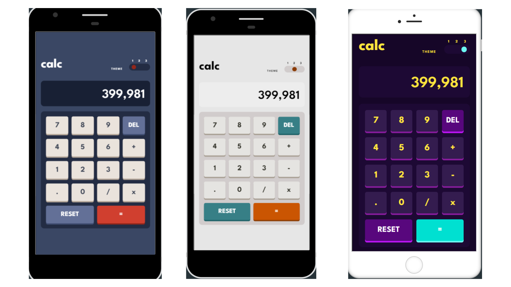

  

  <h1>Frontend Mentor - Calculator app solution</h1>
  <a href="https://calculator-app-c.vercel.app/"><strong>➥ Live Demo</strong></a>

 
# 

This is a solution to the [Calculator app challenge on Frontend Mentor](https://www.frontendmentor.io/challenges/calculator-app-9lteq5N29). Frontend Mentor challenges help you improve your coding skills by building realistic projects. 

## Table of contents

- [Overview](#overview)
  - [The challenge](#the-challenge)
  - [Screenshot](#screenshot)
  - [Links](#links)
- [My process](#my-process)
  - [Built with](#built-with)
- [Author](#author)

## Overview

### The challenge

Users should be able to:

- See the size of the elements adjust based on their device's screen size
- Perform mathmatical operations like addition, subtraction, multiplication, and division
- Adjust the color theme based on their preference
- **Bonus**: Have their initial theme preference checked using `prefers-color-scheme` and have any additional changes saved in the browser

### Screenshot

.png)

.png)

.png)

### Links

- Solution URL: [Click Here](https://github.com/sudhanshu287/calculator-app-frontend-mentor)
- Live Site URL: [Click Here](https://calculator-app-c.vercel.app/)

## My process

### Built with

- Semantic HTML5 markup
- CSS custom properties
- Flexbox
- CSS Grid
- Mobile-first workflow

## Author

- Website - [Sudhanshu Patel](https://sudhanshupatel.vercel.app)
- Frontend Mentor - [@Sudhanshu287](https://www.frontendmentor.io/profile/sudhanshu287)
- Linkedin - [@Sudhanshu287](https://www.linkedin.com/in/sudhanshu287)

## **Let's Connect 👋**

  &nbsp;&nbsp;&nbsp;

  &nbsp;&nbsp;&nbsp;

   &nbsp;&nbsp;&nbsp;

  

